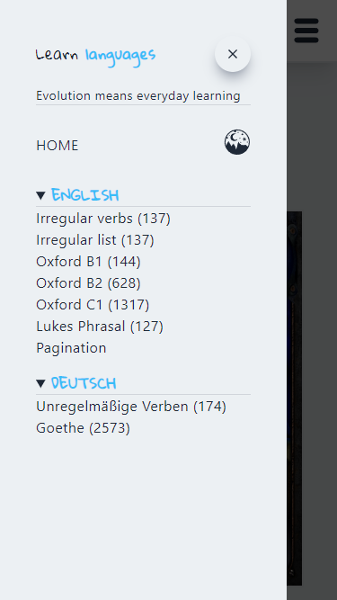
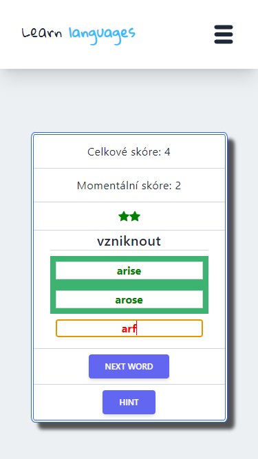
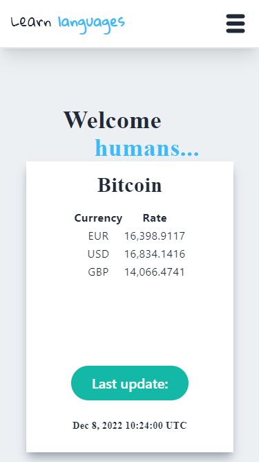
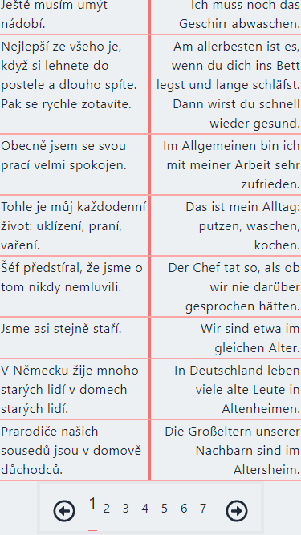
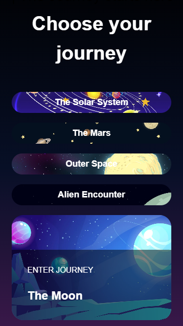
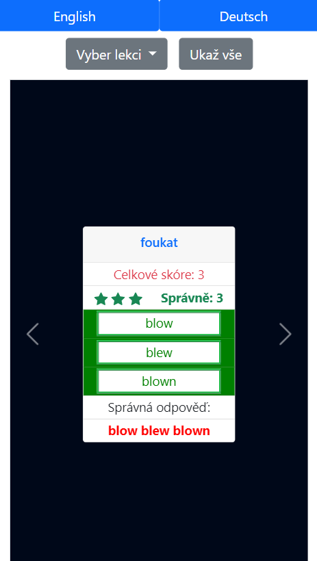

***

 <!---   -->

***
  # ✨Portfolio:✨

 

  
LearnLanguagesApp ENG/GER/CZE

 <a href="https://languages-next-ts.vercel.app/"></img>
 </img>
 </img>                                                                                                              </img>
</a>

  Legacy of Learn languages App
   -👀 [React JavaScript](https://languages-tailwind.vercel.app/ "Visit legacy page")
  - 👀 [NodeJS Express Bootstrap Sass](https://learn-english-and-deutsch.vercel.app/ "Visit legacy page")
  - 👀 [React, Bootstrap](https://react-languages.vercel.app/ "Visit legacy page")

  
 Landing pages 

|Koncern Servis|First Portfolio|Morbus Tschengi|
| :-------------: | :-------------: | :-------------: |
| |  |                                                                                                                                   |
|</img>|</img>|</img>|
|[Visit Site Here](https://koncern-servis.plasmic.run/)|[Visit Site Here](https://my-old-cv.vercel.app/)|[Visit Site Here](https://morbus-tschengi.vercel.app/)|

|Craftsman|Craftsman 2|Cosmos|
| :-------------: | :-------------: | :-------------: |
|                                               |                 |                                                                                            |
|</img>|</img>|</img>|
|[Visit Site Here](https://react-remeslnik.vercel.app/)|[Visit Site Here](https://remeslnik2.vercel.app/)|[Visit Site Here](https://cosmos-flax.vercel.app/)|
 

 

  
 Chat | Cmder CV | TODO 

|Chat Firebase|Cmder CV|Firebase TODO|
| :-------------: | :-------------: | :-------------: |
|  |        |                                                                                           |
|</img>|</img>|</img>|
|[Visit Site Here](https://chatter-eta.vercel.app/)|[Visit Site Here](https://cv-11-2022.vercel.app/)|[Visit Site Here](https://todo-firebase-lake.vercel.app/)|

 

 

  
Legacy

 |Learn languages|CV React|
| :-------------:|:-------------:|
|                                                                                |                                                 |
| </img>                                          | </img>                                                                                     |
| [Visit Site Here](https://react-languages.vercel.app/english-Irregular-Verbs)    | [Visit Site Here](https://resume-one-rosy.vercel.app/experience)    |

 [👀 Next.js resumé / **Under Construction&Broken**](https://next-js-resume-six.vercel.app/ )

 

***
<!--
<picture>
<source
  srcset="https://github-readme-stats.vercel.app/api?username=anthonyzet&show_icons=true&theme=dark"
  media="(prefers-color-scheme: dark)"
/>
<source
  srcset="https://github-readme-stats.vercel.app/api?username=anthonyzet&show_icons=true"
  media="(prefers-color-scheme: light), (prefers-color-scheme: no-preference)"
/>

</picture> -->

 Profile visits:   

