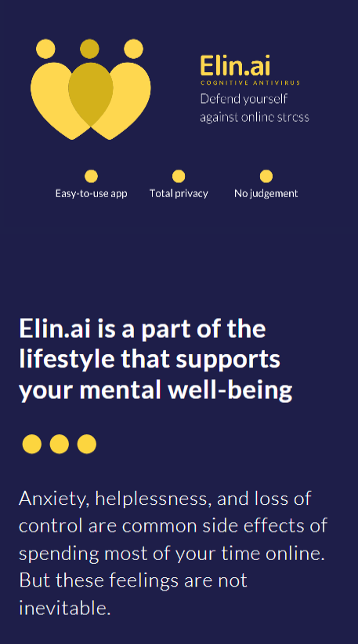
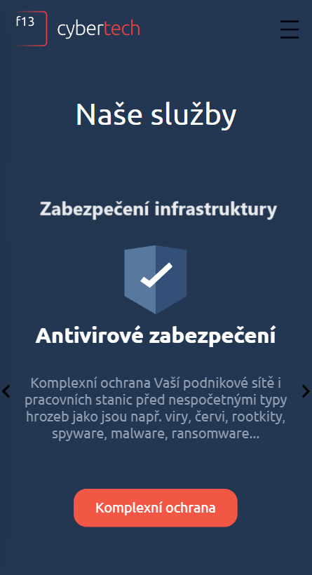

---

---

  

---

# ✨Portfolio:✨

 

  
LearnLanguagesApp ENG/GER/CZE

 <a href="https://languages-next-ts.vercel.app/"></img></a>
 <a href="https://languages-next-ts.vercel.app/english/irregular-verbs"></img></a>
 <a href="https://languages-next-ts.vercel.app/german/memory"></img></a>
 <a href="https://languages-next-ts.vercel.app/"></img>   </a>
 <a href="https://languages-next-ts.vercel.app/english/pagination"></img>
</a>

[![Button Shield]][Languages]

[Button Shield]: https://img.shields.io/badge/Visit_Project-37a779?style=for-the-badge
[Languages]: https://learn-languages-one.vercel.app/

	
 Elin.AI FE Sprint 

 <a href="https://www.elin.ai/"></img></a>
</a>

[![Button Shield]][ElinAi]

[Button Shield]: https://img.shields.io/badge/Visit_Project-37a779?style=for-the-badge
[ElinAi]: https://www.elin.ai/

  
 Landing pages 

| F13 Cybertech | Koncern Servis |  First Portfolio  |
| :-----: | :-----: | :----: |
|  
     

 |  |  |
| </img> | </img>   |  </img>  |
| [Visit Site Here](https://www.f13cybertech.cz/) | [Visit Site Here](https://koncern-servis.plasmic.run/) | [Visit Site Here](https://my-old-cv.vercel.app/) |

|Morbus Tschengi | Craftsman | Craftsman 2 |
| :-------: | :---------: | :--: |
|  |    |   |
|</img>| </img> | </img> |
|[Visit Site Here](https://morbus-tschengi.vercel.app/)| [Visit Site Here](https://react-remeslnik.vercel.app/) | [Visit Site Here](https://remeslnik2.vercel.app/) |

 

 

  
O Penaltového Krále 2023

	<code>"A charity event app. This project facilitates the organization and management of a local football tournament, providing features such as individual registration, penalty kicks schedules, live score updates, and results tracking. Developed collaboratively by enthusiastic students, this app aims to support the club's fundraising efforts while enhancing the overall experience for participants and spectators."</code>

 <a href="https://create-a-developer.vercel.app/"></img>
</a>

[![Button Shield]][Penalty]

[Button Shield]: https://img.shields.io/badge/Visit_Project-37a779?style=for-the-badge
[Penalty]: https://github.com/Nauc-me-IT/penaltovy_kral

  
Create a developer

<code>✅Introducing a free-of-cost extended Sandpack component for the NaucMeIt project, designed with the sole purpose of assisting others on their programming journey.</code>

 <a href="https://create-a-developer.vercel.app/"></img>
</a>

[![Button Shield]][Developer]

[Button Shield]: https://img.shields.io/badge/Visit_Project-37a779?style=for-the-badge
[Developer]: https://create-a-developer.vercel.app/

 

  
 Chat | Cmder CV | TODO 

|  Chat Firebase  |   Cmder CV  | Firebase TODO |
| :--: | :---: | :--: |
|   |  |  |
| </img>   |  </img> |                                                                                     </img> |
|  [Visit Site Here](https://chatter-eta.vercel.app/)   |   [Visit Site Here](https://cv-11-2022.vercel.app/)     |   [Visit Site Here](https://todo-firebase-lake.vercel.app/)     |

 

 

  
Legacy

| Learn languages OLD  |  CV React  |  FirstLanguages |
| :---: | :---: | :---: |
|    |   |  |
|                                                                                                                                                                                                                                                                                                   </img>         |  </img>    |     </img>  |
|    [Visit Site Here](https://react-languages.vercel.app/english-Irregular-Verbs)   |  [Visit Site Here](https://resume-one-rosy.vercel.app/experience)   |  [Visit Site Here](http://learn-languages.great-site.net/English.php)  |

 

---

 Profile visits:   

